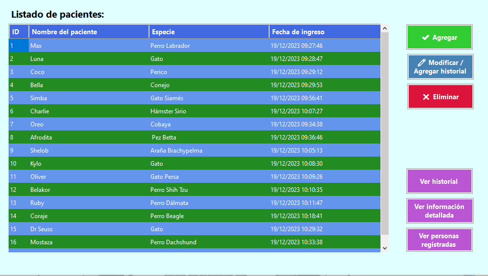
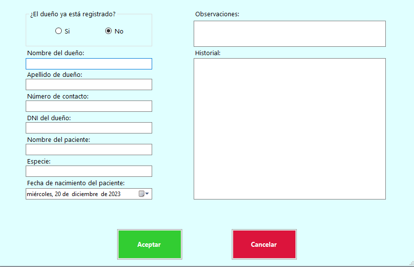

# Veterinaria Pro Manager

La **Veterinaria Pro Manager** es una aplicación de escritorio desarrollada en C# con Windows Forms que permite gestionar la información de animales y sus dueños en un entorno simulado de un veterinario. La aplicación utiliza SQL Server para persistir los datos.

## Funcionalidades

1. **Listado de Pacientes**: Muestra una lista de animales con detalles básicos como id, nombre, especie y fecha de ingreso.

2. **Agregar Paciente**: Permite agregar nuevos animales con información detallada y opciones para dueños registrados o no.

3. **Modificar Información**: Permite modificar la información de un animal y su dueño, con validaciones para evitar duplicados.

4. **Eliminar Paciente**: Permite eliminar un animal seleccionado con confirmación del usuario.

5. **Ver Información Detallada**: Muestra información particular de un animal seleccionado.

6. **Ver Registro de Personas**: Muestra un formulario con el registro completo de personas y animales asociados.

7. **Ver Historial Médico**: Permite ver el historial médico y observaciones de un animal seleccionado.

## Imágenes
**Formulario principal**

**Formulario del paciente**

## Notas

- La aplicación utiliza la clase `AdministradorBD` para gestionar las operaciones de la base de datos.

- Las personas registradas tendrán como ID su DNI y los animales obtendrán uno autogenerado por la base de datos.

- Se realiza un manejo de excepciones y se muestran mensajes de error al usuario en caso de fallos.
---

